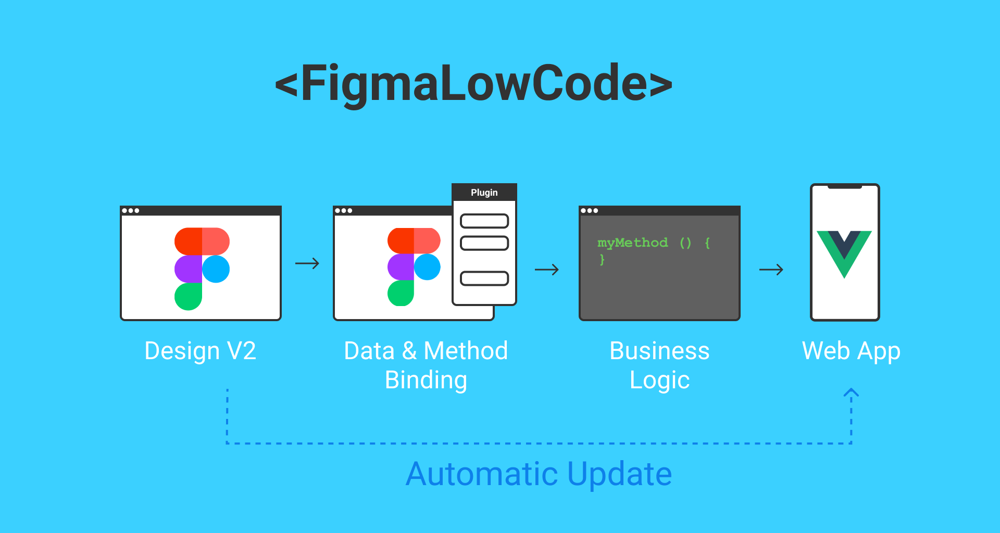
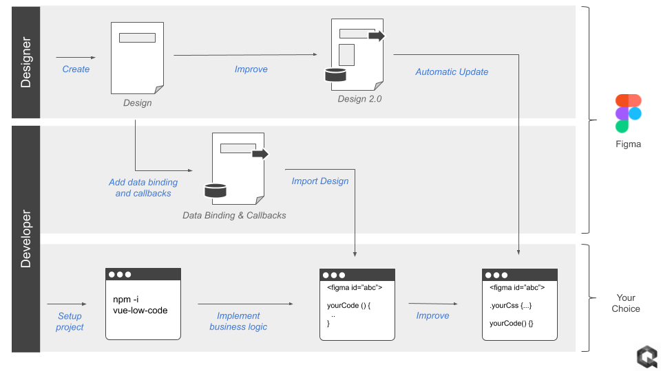
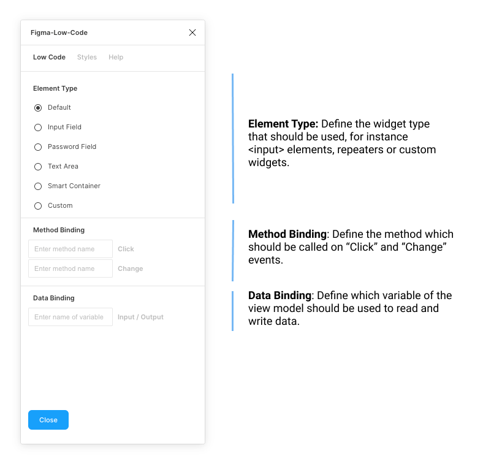
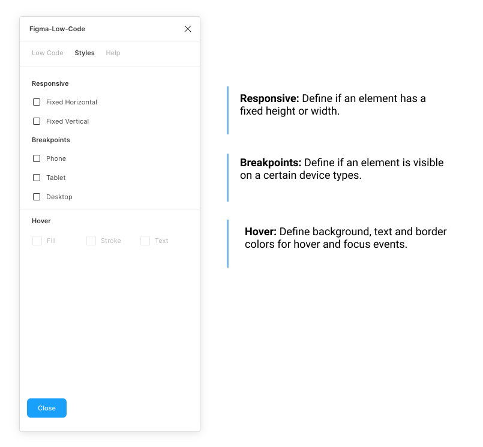

# Figma-Low-Code

Figma-Low-Code is an OpenSource project, that allows to use **Figma** designs directly in **VUE.js** applications. Business logic and data is written as plain JavaScript and 'wired' through data- and method-binding to the visual design. The bindings are defined with the help of a Figma [plugin](https://www.figma.com/community/plugin/858477504263032980/Figma-Low-Code). The low code approach reduces drastically the hand-off time between designers and developers, reduces UI code and ensures that the Figma design stays the single source of truth.

# Introduction Video

[](https://www.youtube.com/watch?v=iyu2rSbUwU8)

The example project can be found here:

[Project](https://github.com/KlausSchaefers/figma-low-code-todo)

[Figma File](https://www.figma.com/community/file/887084011990415230)

[Step by step guide](https://youtu.be/n8YvL_YvXRA)

# Idea
The core of the solution is the **Figma** VUE.js component, which renders the visual design and allows the developers to focus on business logic, without restricting the developers' freedom. The component enables:

1. Zero Code rendering of visual design.
2. Design changes do not require code changes
3. Clear separation of UI and business logic
4. Developers can focus on code
5. Developers can use the tools and frameworks of their choice.
6. Designers stick with their favorite tool
7. Easy extension with custom callback functions
8. Full support of VUE data binding.
9. Extension with custom components
10. Extension with custom CSS
11. Rich library of stylable components.

# Plugin:

You can find the plugin [here](https://www.figma.com/community/plugin/858477504263032980/Figma-Low-Code)

## Workflow

Figma-Low-Code enables the following workflow to facilitate painless collaboration between designers and developers:



1. The designer creates an initial design in Figma
2. The developer adds data binding and method callbacks in Figma using the UX Figma-Low-Code plugin.
3. The developer sets up a new project (Vue.js for now) and includes the **Figma** component
4. The developer links to the Figma design and creates the required methods and fills them with business logic.
5. The **Figma** component renders the design and invokes the callbacks in clicks.
6. Changes in the design are transparent to the developer, he just reloads the design from Figma.
7. For deployment the developer downlaods the figma file to freeze the design


# How to use Figma-low-code

The easiest way to use Figma-Low-Code is to clone this repository and install Node.js version 12 or higher.

```
git clone https://github.com/KlausSchaefers/figma-low-code.git
```

Afterwards, load all dependecies with the following command

``` sh
npm install
```

Finally start the server

``` sh
npm run serve
```


Once done, open the 'src/views/Home.vue' and enter your figma file id and the access code. You can
get the access code in your Figma settings [(Details)](https://www.figma.com/developers/api#access-tokens).
The file id is the second last url parameter

```
https://www.figma.com/file/<FigmaFileId>/...
```

Once you have entered the values, the Home.vue should look like:

``` vue
<template>
  <div class="home">
    <Figma :figma="figmaConfig" v-model="viewModel"/>
  </div>
</template>

<script>
import Vue from "vue";
import Figma from 'vue-low-code'
Vue.use(Figma);

export default {
  name: 'Home',
  data: function () {
    return {
      figmaConfig: {
        figmaFile: '<The figme file id here>',
        figmaAccessKey: '<Your Figma access key ONLY for development>',
      },
      viewModel: {
      }
    }
  },
  components: {
  },
  methods: {
  }
}
</script>

```


## Figma Plugin

To use the advanced features such as data, method binding or input widgets, you must install the  [Figma-Low-Code plugin](https://www.figma.com/community/plugin/858477504263032980/Figma-Low-Code). The plugin has two main tab. The 'Low Code' tab allows you to set the basics, such as the element type, or the input and output data binding.



The 'Style' tab allows you to define, if the element should be fixed width or height. By default Figma Low Code will assume hat the widget is responsive. Also, you can define hover styles for the fill, stroke and text color. For input elements focus styles can also be defined.



## Input Elements

By default Figma-Low-Code renders all elements of the design as div, span and label elements. Often this is not enough, and you
would like to allow the user to enter to. You can override the default rendering by specifying the desired element type, for instance
text fields or password fields.
To do so, you need to launch the Figma-Low-Code plugin and select an element. Once an element is selected, you can select from a list of
widgets the desired element type.


## Data Binding

Figma-Low-Code supports VUE data binding. You have to pass a v-model to the **Figma** component.

``` vue
<Figma :figma="figmaFile" v-model="viewModel"/>
```

You can specify the databinding with the help of the Figma-Low-Code plugin:

1. Launch the plugin
2. Select the desired element.
3. Select the 'Low Code Tab'
4. Specify the name of the varibale, for instance 'user.name'.


During runtime, the low-code component will update the viewModel and add the values entered by the user, e.g.

``` js
    viewModel: {
        user: {
          name: "Klaus"
        }
    }
```

## Method Binding

In the Figma-Low-Code plugin you can define javascript callbacks for the elements. You can specify the databinding with the help of the Figma-Low-Code plugin:

1. Launch the plugin
2. Select the desired element.
3. Select the 'Low Code Tab'.
4. Enter the name of the method taht should be called on the event (click or change are supported for now)


During run time, the figma component will look for a method with the given name in the parent component (in the example  Home.vue). If the method exists, it will be called. The method will have the following signature:

``` js
myMethod (value, element, e) {
 ...
 return 'Screen2'
}
```

If a method return a String matching a screen name, the page will be loaded. In the example the screen with the name 'Screen2'.


## Custom components

If the provided input elements are not enough, you can also hook in your own VUE components. To do so:

1. Launch the plugin
2. Select the desired element.
3. Select the 'Element Type' tab
4. Select Custom
5. Enter the name of the component


Furthermore you will need to register the component with the **Figma** component.

``` vue
<template>
  <div class="home">
    <Figma :figma="figmaConfig" v-model="viewModel" :config="config"/>
  </div>
</template>

<script>
import Vue from "vue";
import Figma from 'vue-low-code'
import MyComponent from './MyComponent.vue';
Vue.use(Figma);

export default {
  name: 'Home',
  data: function () {
    return {
      figmaConfig: {
        figmaFile: '<The figme file id here>',
        figmaAccessKey: '<Your Figma access key ONLY for development>',
      },
      viewModel: {
      },
      config: {
        components: {
          'MyComponent': MyComponent
        }
      }
    }
  },
  components: {
  },
  methods: {
  }
}
</script>

```


## Hover and Focus effects

Often you want certain elements to have a hover effect. For instance, a button should
change the background color if the mouse is hovering it. Also, it is useful to indicate if an input is focused by the user.
To create these kind of effects, perform the following steps:

1. Launch the plugin
2. Select the desired element.
3. Select the 'Style' tab
4. Select a fill (stroke or text) color.

Please note that the colors must be defined upfront in the Figma file, for instance as a style.


# Deployment

Working with the file and access key is great for testing and development, because changes in Figma are visible after a reload.
However, for production you should **NEVER** use the access token, as it gives access
to all your projects. You can download all files into the project by calling the download script.

``` sh
node download.js <access_token> <figma_file_id>
```

The script will download the figma file and all images. You have to point the Figma Component now to the file, instead of the config object. Use an import statement to simply load the JSON.

``` vue
...
<Figma :figma="figmaFile" v-model="viewModel"/>
...

<script>
import FigmaFile from './app.json'

export default {
  name: 'Home',
  data: function () {
    return {
      figmaFile: FigmaFile
      ...
    }
  },
...
</script>

```


## Configure figma-low-code

You can configure certain parameters, e.g. the routing rules. To do so, pass a config object to the
**Figma** component.

``` vue
<Figma :figma="figmaFile":config="config"/>
```

The config object can have the following properties and hsould be defined in the data section of the home component.

``` js
    config: {
        css: {
          grid: true, // Use CSS grid to align objects. False will use CSS-Flex.
          justifyContentInWrapper: true // In justifz or left align content in wrapped elements
        },
        router: {
          key: 'id', // alternative routing parameter
          prefix: 'figma' // path prefix that will be used when rendering links
        }
    }
```


## Custom components and rendering

Sometimes you want to render a certain part of the UI by your self, or replace existing widgets with custom implementations.
You can do this by passing a **components** array to the configuration. These components will be used at the specified screen
location instead of the default Figma component. This approach allows you to fully manage certain parts of the UI. Data is passed
as a **value** property and follows default VUE practices.

``` vue
<Figma :app="app" :config="config"/>
...

<script>
import MyWidget from 'src/myWidget'

...

config = {
  components: [
    {
      cssSelector: ".ArtBoard .ElementName",
      type: "MyWidget",
      component: MyWidget
    }
  ]
}
</script>
```

You specify the widget to be replaced by the custom widget by a css selector. For instance if you want to replace the
widget with the name "Custom" on the "StartScreen" artboard, use the ".StartScreen .Custom" selector.


## MDI Icons

If you are using the Quant-UX icons components, you have to install the mdi-font package.

``` sh
npm install @mdi/font
```

Afterwards import the icons in the App.vue

``` js
import '@mdi/font/css/materialdesignicons.css'
```


# The handoff problem
Designers and developers use different tools to build user interfaces. Once a designer
has completed the interface design, he hands-off the design to the developer, usually
in the form of an image and some specs. The developer has now to rebuild the
entire design using the programming language of his choice. Although this process is
proven, it is rather slow and not very efficient. In particular later changes in
the design makes it hard to automize this work through code generation tools.

# Credits

Figma-Low-Code is based on vue-low-code developed by [Quant-UX](https://quant-ux.com).
